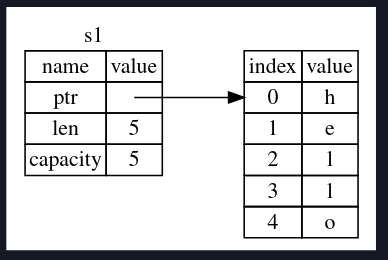
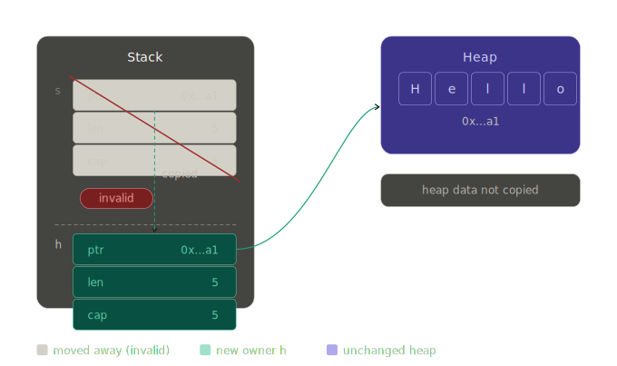
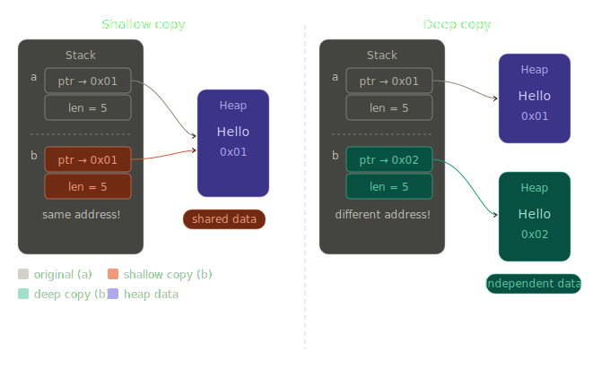
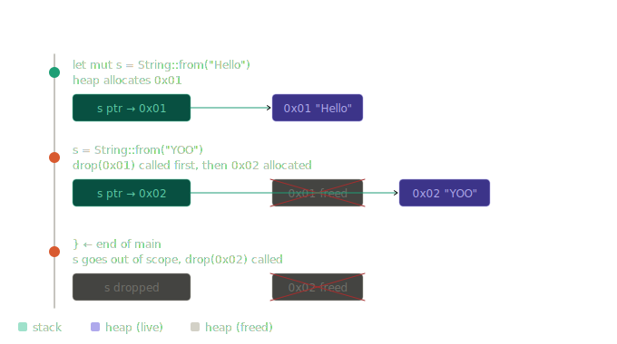
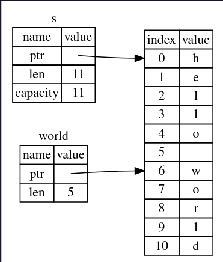

## Chapter 2
- Unless specified rust defualts to i32 type number.
- Variable shadowing occurs in rust when you declare new variable with the same name of another variable declared prior. This allows devs to change the type of the variable to reuse the variable instead of creating another variable.
- The trim() method on a String instance will remove any white spaces at the beginning and the end. If we were to convert a string to integer, this is something that must be done. Or else how would the program interpret any white space within the string..
- in ```std::io::stdin().read_line(&var)``` upon coming to this of program user would be instructed to enter a value. The value will only be passed to the progra after the user presses enter upon entering the value. That is how the method read_line() works. This pressing of enter adds a newline(\n) char at the end of the string typed. So in the case of trim() method, this also eliminates the newline characters at the end of the string.
- Thus when user enters the value 5, the read_line() store 5\n, but after using trim() method the value would be 5 no newline chars.
- the parse() method on rust converts a string to another type. Also in this case we have to explicitly tell rust what number type we wish this string to be converted to, which is u32. This is done in this part of the code ```let guess: u32```. This time guess does not have to be mutable since while the program is running we do not have to write to guess again. It has already been done.
- Also when we compare these two values, since guess is now u32, rust will assume correct should also be u32 in which case it is automatically set to u32 so that both the number can be compared against each other.
- **NOTE** The parse method can only work on characters that can logically be converted to number. Any emojis or special that cannot be translated to number would throw an error. And also parse method returns a result type. And for result type returns you would also have to include an expect(Statement) right alongside.
- The ```loop``` keyword creates an infinite loop.
- The ```break``` keyword is used to break from a loop. such as this:
```rs
    loop {
        println!("Please enter your guess: ");
        let mut guess = String::new();

        io::stdin().read_line(&mut guess).expect("Please enter a number!!");
        println!("Your Guess: {guess}");

        let guess: u32 = guess.trim().parse().expect("Please enter an integer!!");

        match guess.cmp(&correct){
            Ordering::Less => println!("Too low! Try again"),
            Ordering::Greater => println!("To big, Try again"),
            Ordering::Equal => {
                println!("Congrats you won!!");
                break;
            }
        }
```
- Often time with Result returned methods such as purse() or read-_line(), instead of using expect() to crash the program gracefully, we can instead go into using match statements to handle the errors. Such as:
```rs
let guess: u32 = guess.trim().parse(){
    Ok(num) => num,
    Err(_) => continue,
};
```
- As we know parse() returns a Result type, and Result is an enum that has variants of Ok and Err. The underscore in Err(_) is a catch-all, we are saying we will catch all type of error regardless of what it is.

## Chapter 3
- A variable is immutable when data added to that variable cannot be altered.
- By default, Rust variables are immutable. But variables can be made mutable by using the keyword ```mut``` in front of the variable name such as:
```rs
let mut result = 3;
result = 4
// ANd this shoudl be ok since result is mutable..
```
- Difference between let and const in rust is that, let creates a variable that is immutable by default. const defines a compile-time constants ( an alias for a value ) that must be explicitly typed (such that :u32 or :i64) and also cannot be changed.
- const requires type annotation where ```let``` lets the compiler infur the type of the variable automatically.
### Rust: `const` vs. `let`

| Feature | `let` (Variable) | `const` (Constant) |
| :--- | :--- | :--- |
| **Mutability** | Immutable by default; can be made mutable with `mut`. | **Always** immutable. `mut` is not allowed. |
| **Type Annotation** | Optional (usually inferred by the compiler). | **Required** (e.g., `const NAME: type = value;`). |
| **Evaluation** | **Run-time**: Calculated when the program runs. | **Compile-time**: Calculated when the code is built. |
| **Scope** | Local to the block/function where it is defined. | Can be defined in any scope, including **global**. |
| **Value Requirement** | Can hold results of any function or user input. | Must be a **constant expression** (predictable values). |
| **Memory** | Exists on the stack (or heap if specified). | Inlined directly into the binary wherever used. |

---

### 1. Defining `const`
Constants are for values that are fixed for the entire life of the program. They are useful for global configuration or magic numbers.

```rust
// Must have a type, usually written in SCREAMING_SNAKE_CASE
const MAX_POINTS: u32 = 100_000;
```
### What "Known at compile time means??"
- For a value to be used in ```const```, the compiler must be able to resolve its value before the program even runs.
- Analogy:

<ol>
<li> &nbsp;&nbsp;&nbsp;&nbsp;&nbsp;&nbsp;&nbsp;Setting the price of the menu before the restaurant even opens.</li>
<li> &nbsp;&nbsp;&nbsp;&nbsp;&nbsp;&nbsp;&nbsp;Cashing out a customer which depends on their purchase which may &nbsp;&nbsp;&nbsp;&nbsp;&nbsp;&nbsp;&nbsp;&nbsp;increase or decrease.</li>
</ol> 

- Constant values must be set when writing the program. Some return values of functions, or user input cannot be used to initialize a constant.
- Rust convention for writing the name of constant is to be all uppercase with (_) underscore between spaces.
- Constant evaluation is the process of computing the result of expression during compilation. ONly a subset of all expressions can be evaluated at compile-time.
- Const eval (Constant Evaluation) is the process where the compiler executes specific parts of your code and computes their result at compile time, rather than waiting till the program runs.
- When We declare a Const variable in Rust, we are telling the compiler this variable must be computer and evaluated before execution of the program.
- **How the compiler does it?**
- Rust has a built-in interpreter inside of its compiler called **Miri**(Mid-level Intermediate Representation Interpreter). When you compile a program, Miri literally runs your ```const``` code inside of compiler.
- Variable shadowing is the concept that, the Rust compiler will prioritize and use the second same name decalred variable, instead of using first one. One example may clarify:
```rs
fn main(){
    let x = 5;

    let x = x + 1;
    {
        let x = x * 2;
        println!("The value of x in the inner scope is {x});
    }

    println!("The value of the x is: {x}");
} 
```
- This program first creates and initialize x to 5. But then using shadowing by using the keyword ```let``` with the same variable name x, we overshadow the previous variable x and replace its value with x+1 which is 6. Now the value of x is 6 instead of 5. But within the inner scope, we shadow the new x=6 again and multiply it wiht 2 making it 12. But here is the thing, that shadowing is only available inside of that scope. As soon as we get outside of the scope, we see that x is back to 6 again. This would be the result:
```shell
$ cargo run
   Compiling variables v0.1.0 (file:///projects/variables)
    Finished `dev` profile [unoptimized + debuginfo] target(s) in 0.31s
     Running `target/debug/variables`
The value of x in the inner scope is: 12
The value of x is: 6
```
- How shadowing differs from mutability is that, if we tried to do just ```x=x+1;```, this would throw a compile time error, because x is not initialized as a mut variable. But using the keyword ```let``` lets us change the variable x to anything without initializing x as a mut variable.
- Another advantage of shadowing is that, since ```let``` is creating a new variable with the same name,, we can also change the type of that variable. Such as:
```rs
let spaces = "     "; //1
let spaces = spaces.len(); //2
```
Here the variable spaces//1 is a string type and variable spaces//2 is of type int. The keyword ```let``` lets us do that.
- But with ```mut```, changing the value of variable is possible but changing its type is not. Such as:
```rs
let mut spaces = "    ";
spaces = spaces.len();
```
And this should throw a compile-time err.
```shell
$ cargo run
   Compiling variables v0.1.0 (file:///projects/variables)
error[E0308]: mismatched types
 --> src/main.rs:3:14
  |
2 |     let mut spaces = "   ";
  |                      ----- expected due to this value
3 |     spaces = spaces.len();
  |              ^^^^^^^^^^^^ expected `&str`, found `usize`

For more information about this error, try `rustc --explain E0308`.
error: could not compile `variables` (bin "variables") due to 1 previous error
```
## Chapter 3.2: Data Types
- Two data type subset: Scalar, and Compound.
- A *scalar* type represents a single value. Rust has four primary scalar type data: Integer, float, Booleans, and characters.
- 
- Signed and unsigned integers refer whether it is possible for the number to be negative. A number that can never be negative such as values for distance can be represented using **unsigned** integer (Therefore no signs), and number that can be negative of value are represented using **Signed** integers.
- Signed numbers are stored using the two's complement representation.
- Each signed variant can store numbers from $-(2^{n-1})$ to $2^{n-1} - 1$ inclusive. Here $n$ is the number of bits that variant uses. So, an i8 can store number from $2^7$ to $2^7-1$, which equates to -128 to 127. And Unsigned variants can stored number from $0$ to $2^n$, where $n$ is the number of bits that variant uses.
- Generally we use commas to separate big numbers such as 1,000,000. But in Rust, commas cannot be used to separate number. Instead we use (_) underscores such as 1_000_000; and the compiler understands it as 1,000,000.
- **Rust default integer type is i32.**
- Rust floating types are f32 and f64.
- The default float type in Rust is f64.
- <span style="color:lightblue">**All floating points are signed**</span>
```rs
fn main(){
    let x = 4.2 //def f64
    let x: f32 = 3.0 // set to 32 bit float
    //Also reinforces that type can be changed using shadowing
}
```
- In Rust, integer division just like any other programming langauge does not generate fraction or floats. it just goes to zero or near zero.
- The **Boolean** type in Rust can be initiated either using explicit annotations or implicit annotations. Such as:
```rs
fn main(){
    let x = true; //implicit

    let x: bool = false; //explicit
}
```
- Rust Char Data Types:
```rs
fn main(){
    let a = 'a';
    let b: char = 'B";
    let smiley:char = ':)';
}
```
- Notice we declare char datas using single quotations compared to String literals where we use double quotation.
- Rust char data type is of 4 bytes, meaning it can not only represent ASCII chars but also other ACcented letters.
### Compound Types
- Compound types can group multiple values into one type. Rust has two primitive compound types: tuples and arrays.
#### Tuples
- A tuple is a general compound type that can take multiple data types values and combine them into one data type. They have fixed length and can not be changes once declared.
- Syntax:
```rs
fn main(){
    let tup: (datatypeRespectively, datatypeRespectively, datatypeRespectively) = (dataValueRespectively, dataValueRespectively, dataValueRespectively);
}
```
- **Example**
```rs
fn main(){
    let tup: (i32, f64, u32) = (-24, 3.64, 56);
}
```
- One of the ways we can extract values out of a tuple data structure is to use variables and pattern matching:
```rs
fn main(){
    let tuple: (i32, f32, u64) = (-24, 4.5, 21);
    let(x,y,z) = tup;
    // x should have the value -24
    // y should have 4.5
    // z should have 21
    println!("The value of z is: {x});
    println!("The value of y is: {y});
    println!("The value of z is: {z});
}
```
- This method of extracting data from tuple is called destructuring.
- Tuple element can also be accessed and stored in variable using dot notation along with the values index.
```rs
fn main(){
    let tuple: (i32, f64, u64) = (-24, 3.4, 21);
    let x = tuple.0;
    let y = tuple.1;
    let z = tuple.2;

    println!("The value of x is: {x}");
    println!("The value of y is: {y}");
    println!("The value of z is: {z}");

}
```
- In Rust, a tuple without any values assigned to it is called a unit. The name unit comes from Type theory and Mathematics. 
- A tuples number of possible values is the product of its elements possible values. An empty product in math equals to 1. One of the reason why tuples are called product types.
#### Array
- Another way to combine multiple values into one compound type is array.
- Unlike Tuple, all values in array has to be of same type.
- <span style="color:lightblue">**Unlike other languages where array can expand or decrease, Rust arrays are of fixed length**</span>
- Syntax:
```rs
fn main(){
    let a = [value, value, value, ....];
    //Example
    let b = [1,2,3,4];
}
```
- Values inside of an Array Data structure lives on the stack, unlike some other data structure such as vector where its content lives in the heap.
- Vectors unlike array are able to expand or shrink and its datas lives in heap.
- Explicit declaration of array requires declaring data type and its size:
```rs
fn main(){
    let array_name:[dataType; size] = [data];
    // Example
    let a: [i32, 5] = [1,2,3,4,5];
}
```
## Functions
- In Rust, just a refresher, the ```fn``` keyword is used to declare a function.
- Unlike some other languages like ```C```, rust does not care where you define your function. Whether it is before the main() or after main(), as long as it is in the same scope and the caller can call it, it will work.
```rs
fn main(){
	println!("Hello");
	another();
}  
fn another(){
	println!("Another");
}
```

	- This works and
```rs
fn another(){
	println!("Another");
}
fn main(){
	println!("Hello");
	another();
}
```
- Works as well.
- Function can also take in parameters within its braces.
- The syntax: 
```rs
fn argument(variable_name: dataType){
	//things the fn needs to execute
}
```
- In rust fn signature, The signature is the braces of functions (), you must declare the type of each parameter.
- When defining multiple parameters use commas to separate them:
```rs
fn arguments(x: i32, yo: String){
	//THings to execute
}
```
- **Rust is an expression based language**
- ***Statements*** are instructions that perform some action and do not return a value.
- ***Expression*** evaluate to a resultant value.
- Rust is called ***an expression based language*** because almost everything evaluates to a value. Unlike ```C``` and ```Java``` where there is a sharp difference between expression (Produce a value) and statements (do something, produce nothing).
- In Rust, in order to return values from a fn we do not use keywords like ```return```. Rather we use the concept of expression and use -> to denote at the fn header what type of data will be returned.
```rs
fn add(x: i32, y: i32)-> i32{
	x + y
}
fn main(){
	let x: i32 = 5;
	let y: i32 = 6;
	let sum: i32 = add(x,y);
	println!("The sum of {x} & {y} is: {sum}");
}
```
- Although the keyword ```return``` can be used to return a value from the function early if necessary.

## ```if``` Expressions
- Because ```if``` is an expression it can be used to provide value to variables being declared using ```let``` keyword.
- Remember that block of code evaluates to the last expression in them and that can also be numbers. In this case, if one block returns a number expression and the rest of the if block or associated block also must return number type. We will get an error if types are mismatched in ```if``` arms:
```rs
fn main(){
	let condition = true;
	let y = if condition { 5 } else {"Wool"};
	println!("The value of y is: {y}");
}
//this would throw an error because 5 is i32 and "wool" is char.
//Not same data type in both if hands
```
- In Rust, the loop{} acts like while loop in other programs but has no boolean checking like while loop. Rather programmers uses keyword like ```break``` to break out of such loop.
- loops can be labeled as such:
```rs
fn main(){
    let mut count = 0;
    'counting_up: loop {
        println!("Count = {count}");
        let mut remaining = 10;

        loop {
            println!("Remaining: {remaining}");
            if remaining == 9 {
                break;
            }
            if count == 2 {
                break 'counting_up;
            }
            remaining -= 1;
        }
        count += 1;
    }
    println!("End count = {count}");
}
```
- Typically ```break``` and ```continue``` works within the block of loop applied on. But if you want to specify a particular loop to be broken or continued within the entire block that when loop label comes in. 
- **Loop Label must begin with single quote, but dont end with a single quote or any quote marks for that matter**
- ```While``` loop:
```rs
while Condition {
    //Do Task
}
//Example
fn main(){
    let mut number: u32 = 3;

    while number != 0 {
        println!("Yello!!");
        number -= 1;
    }
}
```
- ```while``` loop can be used to loop over compound data types such as array or tuples.
```rs
fn main(){
    let array: [i32; 5] = [1,2,3,4,5];

    let mut index = 0;

    while index < 5 {
        println!("Values: {}", a[index]);

        index += 1;
    }
}
```
- A better approach is ```for``` for traversing through arrays or tuples. Imagine you updated the array to habe 4 elements now, but forgot to update the ```while``` loop. Now the program will panick because it is still looking for the object at 4<sup>th</sup> element.
- For loop for the same code snippet:
```rs
fn main(){
    let a: [i32; 5] = [1,2,3,4,65];

    for elements in a{
        println!("Values: {elements}");
    }
}
```
- Also Rust default range can be used for for loop. You may remember how we set the range up for random numbers in guessing game using this notation ```(startingNum....EndingNum)```. In Rust for loop the same can be done to run the loop a certain time or from certain range as in:
```rs
fn main(){
    for num in (1..4){
        println!("{num}");
    }
}
```
- This code snippet will count up to 4 but not including 4. **REMEMBER THAT**
- The countdown can also be done in reverse using the ```rev()``` fn. such as:
```rs
fn main(){
    for num in (1..4).rev(){
        println!("{num}");
    }
}
```
- Practice generating fibonacci number!!
```rs
use std::io;

fn main(){

}

fn fibonnaci(n: i32) -> i32 {
    let mut prev: i32 = 0;
    let mut current: i32 = 1;

    if n==0{
        prev
    } else if n == 1{
        current
    } else {
        for fib in 2..=n{
            let next = prev = current;
            prev = current;
            current = next;
        }
        current
    }

}
```
# Ownership
- Ownership is the feature that makes Rust such memory safe language. This enables Rust to make memory safety guarantees without needing a garbage collector.
- **Ownership** is a set of protocols that govern how a Rust program manages memory. All programs have to manage the way they use a computer's memory while running.
- In the Stack, only data that are fixed in size should be stored. Dynamic data or data that may change in size should be stored in heap.
- When you put data on the heap, you request a certain amount of space. The memory allocator looks for and finds an empty spot big enough to store the data you are intending on storing and marks that space as allocated/in use, after which it return a pointer(Pointer is value that points to that memory space).
- **Allocating space in heap is known as allocating, but pushing data onto stack is not called allocating necessarily**
- The pointer that is returned from the process of allocation is stored in stack. Why? Why the pointer of heap is stored in stack?? Because the simple reason is that pointer do not change in size. The size of allocated heap may change from 20Kb to 100Kb, but the address does not necessarily change.
- ***Analogy***: Imagine you set up a banquet hall(BH02) for 50 people initially. But later on, the number of people increased to 80 people. So you just add more tables and chairs for the increased number of people. You do not necessarily change the entire banquet hall(BH02) and have people seat in different room. You just increased the capacity of BH02 but did not change the hall itself thus the address of remaining the same..
- Typically pushing onto a stack is much faster than allocating on heap. The sheer reason is the allocator has to find the proper space for the data that is being allocated. Whereas on the stack this function of looking for space do not exist. A processor can work more efficiently if the data that needs to be processed is right next to the current data process. 
- **NOTE**: The main purpose of **Ownership** is to manage heap data.
- Ownership rules(Something to remember or perhaps practice on)
    1. Each value in Rust has an owner.
    2. There can only be one owner at a time.
    3. WHen the owner goes out of scope, the value will be dropped.
- A scope is the range within a program for which an item is valid.
```rs
fn main(){
    // s is not valid here
    let s = "Hello";
    // The scope of var "s" start at
    // First { and ends }. This var
    // can not be accessed outside of
    // this scope.
}
```
- Such that this code snipper will not compile:
```rs
fn main() {
    println!("Out of Scope {s}");
    let s = "Hello";
    println!("In scope {s}");
}
```
```sh
HOST@HOST-edu in repo: ownership/src on  main +/- [?] via 󱘗 v1.94.0 
 󰛓 ❯ cargo run
   Compiling ownership v0.1.0 (/home/playaow/Documents/Rust/ownership)
error[E0425]: cannot find value `s` in this scope
 --> src/main.rs:3:28
  |
3 |     println!("Out of scope{s}");
  |                            ^ not found in this scope

For more information about this error, try `rustc --explain E0425`.
error: could not compile `ownership` (bin "ownership") due to 1 previous error
```
## The ```String``` Type
- String literal can be initiated using the from() function.
```rs
fn main(){
    let s = String::from("Hello");
}
```
- String initiated using from() can be mutated and additional data can be added to these.
```rs
fn main(){
    let mut s = String::from("Hello");

    s.push_str(", world"); //push_str appends a literal to a string
    println!("{s}");
}
```
- String literals such as ```let s = "Hello"``` is hardcoded in the program at compile time. You cannot change the size of this variable at runtime because it is stored at stack.
- While as we can see, a ```String``` data type that lives on heap can be expanded and you can ask for more room to the OS depending on your need, it the room gets allocated at runtime.
- When the variable "s" goes out of scope, Rust calls a special function for us called ```drop```, and it is where the author of ```String``` can put the code to return the memory.
- Although this concept looks simple now, but it can become a problem in a production based program where we need multiple variable later on that needs to use that data, but that scope of the data is now met.... What do you do now??
- Assigning value of one variable to another works when we are working with scalar data types, types such as i32, u32, i64, u63, char, boolean etc:
```rs
fn main(){
    let x: i32 = 5;
    let y: i32 = x;
}
```
    
* This will work because we are working with fixed sized data.
- But lets try the same thing but with ```String``` type:
```rs
fn main(){
    let s = String::from("Hello");
    let h = s;
    println!("{s}");
    println!("{h}");
}
```
- AND Drumrollllssssss
```sh
…opps in repo: ownership on  main +/- [?] is 󰏗 v0.1.0 via 󱘗 v1.94.0 took 16s157ms
󰛓 ❯ cargo run
Compiling ownership v0.1.0 (/home/oops/Documents/Rust/ownership)
error[E0382]: borrow of moved value: `s`
--> src/main.rs:5:16
|
2 |     let s = String::from("Hello");
|         - move occurs because `s` has type `String`, which does not implement the `Copy` trait
3 |     let h = s;
|             - value moved here
4 |     //s.push_str(", world");
5 |     println!("{s}");
|                ^ value borrowed here after move
|
= note: this error originates in the macro `$crate::format_args_nl` which comes from the expansion of the macro `println` (in Nightly builds, run with -Z macro-backtrace for more info)
help: consider cloning the value if the performance cost is acceptable
|
3 |     let h = s.clone();
|              ++++++++

For more information about this error, try `rustc --explain E0382`.
error: could not compile `ownership` (bin "ownership") due to 1 previous error

```
- Wonder why this does not work especially with types like ```String``` that lives on the heap.
- A ```String``` data type is made up of 3 parts:
    * a **pointer** to the memory that holds the contents of the string.
    * a **length**
    * a **capacity**
- These data that makes up the ```String``` data type are stored on the stack. So a pointer, length, and capacity all these values are stored on stack.

- And on the right side of the image is the ***heap*** that contains the actual data that ```String``` instance holds.
- The ***ptr*** is a pointer that is pointing to the memory location of the heap that contains the data.
- The ***length*** is how much memory, ***in bytes***, the contents of the ```String``` instance are currently using.
- The ***capacity*** is the total amount of memory the ```String``` received ***in bytes*** from the allocator.
- So when we assign ```s``` to ```h```, we actually assign the pointer value, length and capacity that is associated with ```s``` to ```h```. The data on the stack gets copied into ```h```, but the actual content that resides on the heap does not get copied to ```h```.

- And this action also deletes ```s``` as the owner of the data bytes "Hello" since in Rust, only one variable can point to one block of heap data at a time.
- Here is what happens when we assign ```s``` to ```h```:
```rs
fn main(){
    let s = String::from("Hello");
    let h = s;
    println!("{s}");
} 
```
```sh
󰛓 ❯ cargo run
Compiling ownership v0.1.0 (/home/opps/Documents/Rust/ownership)
error[E0382]: borrow of moved value: `s`
--> src/main.rs:5:16
|
2 |     let s = String::from("Hello");
|         - move occurs because `s` has type `String`, which does not implement the `Copy` trait
3 |     let h = s;
|             - value moved here
4 |     //s.push_str(", world");
5 |     println!("{s}");
|                ^ value borrowed here after move
|
= note: this error originates in the macro `$crate::format_args_nl` which comes from the expansion of the macro `println` (in Nightly builds, run with -Z macro-backtrace for more info)
help: consider cloning the value if the performance cost is acceptable
|
3 |     let h = s.clone();
|              ++++++++

warning: unused variable: `h`
--> src/main.rs:3:9
|
3 |     let h = s;
|         ^ help: if this is intentional, prefix it with an underscore: `_h`
|
= note: `#[warn(unused_variables)]` (part of `#[warn(unused)]`) on by default

For more information about this error, try `rustc --explain E0382`.
warning: `ownership` (bin "ownership") generated 1 warning
error: could not compile `ownership` (bin "ownership") due to 1 previous error; 1 warning emitted
```
- If Rust allowed 2 vars to points to the same memory block, when both vars go out of scope, they will both try to free the same memory block. This sounds like a problem and it is. This problem is known as ***Double free error*** and is one of the safety memory bugs.
- Freeing memory twice and letting user free same memory block is a recipe for security valnerabilities.
- This is one of the reason Rust takes off ```s```'s ownership of the heap memory block from it once it is assigned to ```h```. This effectively ensures the problem of ***Double Free Error*** does not occur.
- Such as in C, there is no mechanism such as **ownership**, reason why ***Double Free Error*** is relatively common in ```C```:
```c
#include <stdlib.h>

int main() {
    int *ptr = (int *)malloc(sizeof(int)); // Allocate memory
    if (ptr == NULL) return 1;

    free(ptr); // First free: OK
    free(ptr); // Second free: DOUBLE FREE ERROR

    return 0;
}
```
- Lets review the concept of Shallow and Deep copy:
    * **Shallow Copy**: creates a new object with copied stack fields, but any heap data those fields point to is shared — not duplicated. Both the original and the copy point at the same memory.
    * **Deep Copy**: creates a new object with copied stack fields and duplicates the heap data into a completely new memory allocation. The two objects are fully independent.

- One of the bigger difference between deep and shallow copy is that, in shallow copying making any changes to the original variable will also change the shallow copied variable. But with deep copy, making any changes to the original variable wont effect the deep copied variable.
- Now that review is done, looking at the assigning action of ```s``` to ```h``` looks very similar to shallow copy right. Pointer, length, and capacity being copied and all. But one difference is that the original variable ```s``` does not own that heap memory block anymore after shallow copy and ownership transfers onto the new variable ```h```.
- Since this is not entirely a shallow copy, in Rust it is called move rather.
- It is also a design choice, considering Rust will never automatically create Deep Copies of your data because automatic copy can be assumed to be expensive in terms of runtime performance.
## Scope and Assignment
- When you assign new data to the existing variable, Rust also calls the ```drop``` in that circumstance as well.
```rs
fn main(){
    let mut s = String::from("Hello");
    // Data Now "Hello" stored in some memory block 0x01
    // drop() called
    s = String::from("YOOO");
    // Now Data "YOOO" stored in some other memory block 0x02
} //drop called again to get s OOS
```

- When new data is assigned the previous memory block that contained "Hello" is freed and a new memory block (lets say 0x02) is assigned for the new data "YOOO"
- This program also prints out the mem location so it is more intuitive:
```rs
fn main() {
    let mut s = String::from("Hello");
    println!("Before: {:p}", s.as_ptr());  // prints heap address of "Hello"

    s = String::from("YOOO");
    println!("After:  {:p}", s.as_ptr());  // prints heap address of "YOOO"
}
```
```sh
󰛓 ❯ cargo run
Compiling ownership v0.1.0 (/home/oops/Documents/Rust/ownership)
Finished `dev` profile [unoptimized + debuginfo] target(s) in 0.14s
Running `target/debug/ownership`
Before: 0x5581a2034d50
After:  0x5581a2034d70
```
- In order to actually copy not only the stack data but also heap data, a method such as ```clone``` can be used to copy everything within the data.
```rs
fn main(){
    let s = String::from("Hello");

    let h = s.clone();

    println!("s = {s}, h={h}");
}
```
- But ownership does not work for data that are not fixed size. Meaning the kind of data that has a size that is known at compile time.
- Fixed size data are stored on the stack and they can be copied into other variable without invalidating the previous variable.
```rs
fn main(){
    let x: i32 = 5;
    let y: i32 = x;

    println!("x={x}, y={y}");
}
```
- This should work because the concept of deep and shallow copy do not exist when data is on stack. So Rust does not invalidate ```x``` and both ```x``` and ```y``` works in this case.
- The previous example is an example of Rust's ```Copy``` trait. In rust, when a known sized variable is assigned to another known sized variable, the old variable is not moved but rather copied into the new variable while also retaining it original place in stack.
- The ```Copy``` in not implemented on a variable if that variable or any part of it has to use the ```drop``` trait later down the line. Such as a ```String``` type has to use ```Drop``` trait once it goes out of scope. You cannot use the ```Copy``` trait on that ```String``` type, and using it will give you compile time error.
- When it comes to assigning or passing a variable as argument to a function, it works the same way depending on the type it may copy or move.
- Passing a variable of types that lives on the heap to a function will take the ownership of the data from that variable. Such as:
```rs
fn main(){
    let s = String::from("Hello");
    move_here(s);
    println!("s={s}"); //Should be err here
}
fn move_here(some_string: String){
    println!("{s}");
}
```
- And as expected:
```sh
❯ cargo run
   Compiling ownership v0.1.0 (/home/oops/Documents/Rust/ownership)
error[E0382]: borrow of moved value: `s`
 --> src/main.rs:4:16
  |
2 |     let s = String::from("Hello");
  |         - move occurs because `s` has type `String`, which does not implement the `Copy` trait
3 |     move_here(s);
  |               - value moved here
4 |     println!("{s}");
  |                ^ value borrowed here after move
  |
note: consider changing this parameter type in function `move_here` to borrow instead if owning the value isn't necessary
 --> src/main.rs:6:27
  |
6 | fn move_here(some_string: String){
  |    ---------              ^^^^^^ this parameter takes ownership of the value
  |    |
  |    in this function
  = note: this error originates in the macro `$crate::format_args_nl` which comes from the expansion of the macro `println` (in Nightly builds, run with -Z macro-backtrace for more info)
help: consider cloning the value if the performance cost is acceptable
  |
3 |     move_here(s.clone());
  |                ++++++++

For more information about this error, try `rustc --explain E0382`.
error: could not compile `ownership` (bin "ownership") due to 1 previous error
```
- The error output is pretty self-explanatory and can be seen what is going wrong here. By passing the variable "s" as arg to the fn move_here, we moved the variable ```s``` into the variable of function ```some_string```. And after passing the variable ```s``` to the fn, when we try to print the variable ```s``` again, we see a ownership related error. It is because once we pass ```s``` as an argument to a function we are moving the variable into the variable the function uses, in this case it is ```some_string```. And this takes ownership of the memory block from ```s``` and assigns it to ```some_string```. Thus ```s``` goes out of scope.
- But copying works on scalar data types. When we are doing the exact same thing but with a scalar data type of ```i32``` and it works and the original variable also stays the same and does not move. It retains its own stack space:
```rs
fn main() {
    let s = String::from("Hello");
    move_here(s);
    //println!("{s}");
    let y: i32 = 5;
    copy_here(y);
    println!("y={y}");
}
fn move_here(some_string: String){
    println!("{some_string}");
}
fn copy_here(x: i32){
    println!("{x}");
}
```
```sh
 󰛓 ❯ cargo run
   Compiling ownership v0.1.0 (/home/oops/Documents/Rust/ownership)
    Finished `dev` profile [unoptimized + debuginfo] target(s) in 0.08s
     Running `/home/oops/Documents/Rust/ownership/target/debug/ownership`
Hello
5
y=5
```
- It works perfectly fine and the old variable ```y``` still retains its stack space and associated value.
- A function that return values can also assign or change ownerships depending on how it is implemented:
```rs
fn gives_ownership() -> String{
    let s = String::from("yours");
    s
}
// This function assigned to a variable x, will take the ownership of memory block from its internal variable s, and hand it over to x.
```
```rs
fn takes_and_gives(s: String) -> String{
    s
}
// This function takes a ownership from a variable and assign it to another.
```
```rs
fn main(){
    //full picture
    let s = gives_ownership();
    println!("{s}");
    // this transfers ownership of internal variable
    // x to the main variable s.
    // Now s owns the memory block
    // x used to own and x owns nothing
    let s2 = String::from("hello");
    println!("{s2}");
    let s3 = takes_and_gives(s2);
    println!("s2 out of scope now, s3={s3}");

    // s2 takes a memory block w content
    // "hello"
    // s3 now implements the fn
    // takes and gives, and it takes
    // ownership of s2 and assigns it
    // to s3 now.
}

fn gives_ownership()->String{
    let x = String::from("Yours");
    x
}

fn takes_and_gives(s: String) -> String{
    s
}
```
```sh
❯ cargo run
   Compiling ownership v0.1.0 (/home/oops/Documents/Rust/ownership)
    Finished `dev` profile [unoptimized + debuginfo] target(s) in 0.08s
     Running `/home/oops/Documents/Rust/ownership/target/debug/ownership`
Yours
hello
s2 out of scope now, s3=hello
```
- As we can see functions can be used to transfer ownerships of data. But here is the problem. What if we want to take data as arguments to function but do not want that data to be invalidated as soon as the function goes out of scope. According to ownership rule it seems impossible.
- Rust does let us return tuples with multiple values:
```rs
fn main(){
    let c =  String::from("Hello");
    let (s, len) = string_len(c);
    println!("String: {s}, and length: {len}");
}

fn string_len(s: String) -> (String, usize){
    let length = s.len();
    (s, length)
}
```
- Luckily Rust has a mechanism for passing in values into function without having that argument var lose it ownership of the data. It is called ```references```.
- A **reference** is like a pointer in that it's an address we can follow to access the data stored at that address; that data is owned by some other variable. Unlike a pointer, a reference is guaranteed to point to a valid value of a particular type for the life of that reference.
## Pointer VS Reference
### Raw Pointer
- A raw pointer is just memory address with no rules attached. Rust has two kinds:
```rs
fn main(){
    let x = 5;
    let p: *const i32 = &x; //immutable pointer
    let p1: *mut i32 = &mut x;
    //Mutable Pointer
}
```
- Raw pointers are essentially "C" style pointers and Rust lets you have them, but:
    * The compiler puts ***zero guarantees*** on them.
    * Dereferencing them requires an ```unsafe``` block.
    ```rs
    unsafe {
        println!("{}", *p) //you are on your own here
    }
    ```
    * They can be null, dangling, misaligned. Rust won't stop you.
### Reference
- A reference is a pointer with a compiler enforced rules on top.
```rs
fn main(){
    let x = 5;
    let r: &i32 = &x; //Immutable Ref
    let r2: &mut i32 = &mut x; //Mutable Ref
    println("{}", *r); //No unsafe needed
}
```
- Rules enforced on Reference:
    * Always valid: Can never be null or dangling.
    * Always point to live value: compiler guarantees this via lifetimes.
    * Either one mutable reference OR any number of immutable references at a time, never both simultaneously.
- By ***zero guarantee***, with Raw pointer, Rust means the checks done by compiler is completely off when used raw pointer. Normally Rust guarantees:
    * The value is always initialized before use.
    * This memory is always valid and alive.
    * No two things can mutate the same data simultaneously.
- In Rust ```unsafe``` block is needed when dereferencing a pointer. Typically in a language like ```C```, you won't need an unsafe block to deref a pointer. But is Rust you do, it is almost like Rust is asking you to a sign a waiver saying "I know what I am doing, If anything goes wrong it is not your fault."
--------------------------------------
**Well now that, we looked at the difference between Pointer and Reference, Lets get back to the prev program**
- Here is how the function ```calculate_len``` can be used without taking ownership of the variable being passed as args:
```rs
fn main(){
    let s = String::from("hello");
    let len: usize = calculate_len(&s);

    println!("{s} everyone");
    // s is still valid and have ownership
    println!("Length of s: {len}");
    // len variable is a separate entity
    // and calculate_len did not take
    // ownership away from s
}

fn calculate_len(s: &String) -> usize{
    let length: usize = s.len();
    length
}
```
- An analogy that can clear things up when it comes to reference is that, reference is a mechanic. He knows the address of the mechanic shop he works at. He goes there and uses the tools belonging to the mechanic shop to accomplish his task or function. But he does not own those tools. He just has limited access to them when needed.
- How this analogy holds up:
    * The mechanic can use the tools (eg data), but the tool never leaves the shop.
    * The shop owner still owns the shop.
    * If the mechanic only has read access (```&T```), he can look at and use the tools but cannot modify them. Immutable tools.
    * If the mechanic has special permissions ```&mut T```, he can rearrange or modify the tools.
- This action of using a reference rather than taking the entire value is called ***borrowing*** as in real life, when you borrow something from a person who owns something, you do have to give it back. You cannot take ownership of it. Just like that the arg variable "s" does not take the ownership of fn main() -> s, but rather just borrow what fn main() -> s has and gives the ownership back once calculate_len() -> s goes out of scope.
- And unlike other languages such as C, or C++, where you can reference an object and change the content of the object you are referencing to within a function, in rust you cannot do that. As in:
```rs
fn main(){
    let s = String::from("Hello");
    
    change_var(&s);

    println!("{s}");
}

fn change_var(some_string: &String) -> String{
    some_string.push_str(", world");
    some_string
}
```
- ANd you should see something like this:
```shell
oops@oop-edu in repo: ownership/src on  main +/- [?] via 󱘗 v1.94.0 
 󰛓 ❯ cargo run
   Compiling ownership v0.1.0 (/home/playaow/Documents/Rust/ownership)
error[E0596]: cannot borrow `*some_string` as mutable, as it is behind a `&` reference
  --> src/main.rs:10:5
   |
10 |     some_string.push_str(", world");
   |     ^^^^^^^^^^^ `some_string` is a `&` reference, so it cannot be borrowed as mutable
   |
help: consider changing this to be a mutable reference
   |
 9 | fn change_var(some_string: &mut String){
   |                             +++

For more information about this error, try `rustc --explain E0596`.
error: could not compile `ownership` (bin "ownership") due to 1 previous error
```
- Although lets try to the same thing but declaring ```s``` as mutable:
```rs
fn main(){
    let mut s = String::from("Hello");

    change_var(&mut s);

    println!("{s}");
}
fn change_var(some_string: &mut String){
    some_string.push_str(", world");
}
```
- And this works:
```shell
 playaow@jo in repo: ownership/src on  main +/- [?] via 󱘗 v1.94.0 
 󰛓 ❯ cargo run
   Compiling ownership v0.1.0 (/home/playaow/Documents/Rust/ownership)
    Finished `dev` profile [unoptimized + debuginfo] target(s) in 0.18s
     Running `/home/playaow/Documents/Rust/ownership/target/debug/ownership`
Hello, world
```
- **One big security design that Rust implements in terms of ```mut``` reference is that, if one mut reference is made, you cannot have any other mut reference to that same value.**
- But a workaround is that, you can create multiple references of mutable object by wrapping the references inside of curly brackets.
```rs
fn main(){
    let mut s = String::from("Hello World");

    {
        let r = &mut s;
        println!("{r}");
    }
    let r1 = &mut s;
    println!("{r1}");
}
```
```shell
 playaow@lol-edu in repo: ownership/src on  main +/- [?] via 󱘗 v1.94.0 
 󰛓 ❯ cargo run
   Compiling ownership v0.1.0 (/home/playaow/Documents/Rust/ownership)
    Finished `dev` profile [unoptimized + debuginfo] target(s) in 0.08s
     Running `/home/playaow/Documents/Rust/ownership/target/debug/ownership`
Hello World
Hello World
```
- Same with combining mutable and immutable ref. If you already made a immutable ref to a mutable object and then tried to create another ref of mutable type to the same object you would get an error.
```rs
fn main(){
    let mut s = String::from("Rust");

    let _r = &s;
    let _r1 = &mut s;

    println!("{_r}");
    println!("{_r1}");
}
```
```shell
󰛓 ❯ cargo run
   Compiling ownership v0.1.0 (/home/playaow/Documents/Rust/ownership)
error[E0502]: cannot borrow `s` as mutable because it is also borrowed as immutable
 --> src/main.rs:5:15
  |
4 |     let _r = &s;
  |              -- immutable borrow occurs here
5 |     let _r1 = &mut s;
  |               ^^^^^^ mutable borrow occurs here
6 |
7 |     println!("{_r}");
  |                -- immutable borrow later used here

For more information about this error, try `rustc --explain E0502`.
error: could not compile `ownership` (bin "ownership") due to 1 previous error
```
- **NOTE**: You can take multiple immutable reference for an mutable or immutable object. BUT, you cannot take mutable ref to an immutable object.
- **NOTE**: The scope of references are from the time they are introduced to the point they are used. Once they are used, you can create another mutable reference without any problem:
```rs
fn main(){
    let mut s = String::from("Rust");

    let r = &mut s;
    println!("{r}");

    let r1 = &mut s;
    println!("{r1}");
}
```
```shell
󰛓 ❯ cargo run
   Compiling ownership v0.1.0 (/home/playaow/Documents/Rust/ownership)
    Finished `dev` profile [unoptimized + debuginfo] target(s) in 0.08s
     Running `/home/playaow/Documents/Rust/ownership/target/debug/ownership`
Rust
Rust
```
- This works because the first mut ref ```r``` is used and thus ```r```scope is cleared and second mut ref ```r1``` start later which is then subsequently and compiler passed it.
### Dangling References
- ***Dangling Pointer***: A pointer that reference a memory block that may have been given to someone else. eg: freeing some memory block while preserving a pointer to that memory.
- In languages like C/C++, a dangling pointer occurs when a pointer holds a memory address that has already been freed. Accessing it leads to undefined behavior — garbage values, crashes, or silent corruption.
Rust prevents this entirely at compile time using its borrowing rules. Consider this example:
- Rust in contrast prevents dangling pointer by using borrowing mechanism:
```rs
fn main(){
    let dangling_pointer = dangling();
}
fn dangling() -> &String{
    let s = String::from("Hello");
    &s
}
```
- ```s``` is declared inside dangling, so its scope is tied to that function. The moment ```dangling``` finishes, ```s`` goes out of scope and Rust calls ```drop()```, freeing the heap memory that "Hello" was stored in. Returning ```&s``` would hand the caller a reference pointing at memory that no longer exists.

### Different Types of References
#### The Slice Type
- ***Slices*** lets you reference a contiguous sequence of elements in a <span style="color:lightblue">collection</span>. A slice is a reference type, so it does not change or take ownership away.
#### String Slices
- A String slice is a reference to a contiguous sequence of the elements of a String.
```rs
fn main(){
    let s = String::from("Hello, World");

    let hello = &s[0..6];
    let world = &s[7..];
}
```
- In this case, rather than referencing the entirety of the String, we make 2 references. The ```hello``` that refers to the data "Hello," and ```world``` that refers to the rest of the data which is "World". The syntax is ```&var_Name[StartingINdex...EndingIndex]```. The slice data type stores the starting position and the length of the slice, which corresponds to ```ending_index``` - ```starting_index```. So in this case the slice ```world``` would point to the starting bytes of ```s``` which is "w" and it length is 5. 
- Even this works. It works just like ```Python``` slicing:
```rs
fn main(){
    let s = String::from("Hello, World");

    let hello = &s[0..6];
    let world = &s[7..];

    println!("{:?}", hello);
    println!("{:?}", world);

    let hello1 = &s[..6];
    let world1 = &s[7..];

    println!("{:?}", hello1);
    println!("{:?}", world1);

    let len = s.len()
    let string = &s[..len];

    println!("{:?}", string);
    
    let string1 = &s[..];

    println!("{:?}", string1);
    
}
```

- Example of Immutable to Mutable
```rs
fn main(){
    let mut s = String::from("Hello, World");
    let word = first_word(&s);

    s.clear();

    println!("The first word is: {word}");
}

fn first_word(s: &String) -> &str {
    let bytes = s.as_bytes();

    for(i, &item) in bytes.iter().enumerate() {
        if item == b' ' {
            return &s[0..i];
        }
    }
    &s[..]
}
```
- This does not work, because first we took immutable ref, then tried to take mutable ref using ```s.clear()```, the ```clear()``` takes mutable ref. Taking immutable ref of an object and then without using the immutable ref first (Which takes the imut ref out of scope) trying to create a mut ref would throw an error.
```shell
|     let word = first_word(&s);
  |                           -- immutable borrow occurs here
4 |
5 |     s.clear();
  |     ^^^^^^^^^ mutable borrow occurs here
6 |
7 |     println!("The first word is: {word}");
  |                                   ---- immutable borrow later used here

For more information about this error, try `rustc --explain E0502`.
error: could not compile `ownership` (bin "ownership") due to 1 previous error
```
- **String literals in Rust are stored inside of the binary executable**
- &str is an immutable reference.
- A &String slice and &str slice are the same thing in rust. And this is made automatic by Rust which uses a feature called deref coercion. 
- **Reference to a String and whole Slice of a String are the same thing**.

# Struct
- A ***struct** or structure is a custom data type that lets you package together name, multiple related values that make up a meaningful group. A struct is like a object's data attribute.
- ```Struct``` are like ```tuples``` in that they can hold values of multiple types. But unlike ```tuples```, where you just get to define the types of the data stored such as: ```let s: (i32, i64, u32, char) = (1,2,3,'c');```, and then have to use the variable ```s``` to refer to piece of data. In Struct, you can name each piece of the data you define inside of it.
- Being able to add names/labels to your data means you have more flexibility. You can access that part of the data without remembering the sequence or index. You can just call it by name. And for us humans, recalling names is much easier compared to remembering numbers.
- In Rust, to define a struct, we use the ```struct``` keyword as in ```struct structName {}```. A struct name should describe the significance of the pieces of data being grouped together.
- Inside the curly brackets {}, we define the names and types of the data we are grouping together. These are called fields.
Below is an example of a struct that stores and groups data related to an user account:
```rs
struct User {
    active:bool,
    username: String,
    email: String,
    sign_in_count: i32,
}
```
- To use a struct after we have defined it, we create an object of the struct DataType or instance of that defined struct and fill out values for each of the fields.
- After creating the instance, we want to write out the name of the struct, in this case ```User{}```, inside the curly brackets we write down the field name and provide appropriate values to those field.Just like this:
```rs
struct User{
    active:bool,
    name:String,
    age:i32,
    sign_in_last: u32,
}
fn main(){
    let ray:User = User{
        active: true,
        name: String::from("Ray"),
        age: 24,
        sign_in_last: 60,
    };
    println!("Name: {0}", ray.name);
}
```
- **You do not have to maintain the order of fields when setting them up with appropriate values**.
- In order to get access to a specific value from struct we use dot notation as in ```StructName.Key```, where ```Key``` is the field name. 
- Also with dot notation, you can change or update the value that resides with the key if the instance is mutable. As in, in the previous example, if ray is mutable you can change age by using dot notation like this:
```rs
struct User {
    active: bool,
    name: String,
    age: i32,
    sign_in_count: u64,
}
fn main(){
    let mut ray: User = User{
        active: true,
        name: String::from("Ray"),
        age: 27,
        sign_in_count = 3,
    };

    ray.age = 29;
}
```
- ***NOTE***: Rust does not allow only specific fields to be mutable. Either the intire instance of the struct has to be mutable or not mutable at all.
- Also functions can be used to return a user instance:
```rs
fn create_user(name: String, age: i32, active: bool, sign_in_count: u64)-> User{
    User {
        active: active,
        name: String::from(name),
        age: age,
        sign_in_count: sign_in_count,
    }
}
```
- Now this works, but imagine if you are working with a huge struct with a lots of fiels. Imagine writing age:age, name:name, and all these key:pair values over and over again for multiple instances. The Field Init shorthand at least prevents developer from writing key:value pairs in a function like build_user over and over again. In field init system, since the fn args and struct field name are the same, we can do this:
```rs
fn build_user(name: String, email: String) -> User{
    User{
        name,
        email,
        active: true,
        sign_in_count: 2,
    }
}
```
- Whatever developers provide us in the fn arguments will automatically get assigned to the appropriate fields. No need to do name: name, anymore. Especially if the field and fn args match in name.
## Creating Instances with Struct Update Syntax
- It is often useful when creating new instance of the same type, to use some of the value of other instance. Such as lets say we are to introduce a new employee in the company. We are creating a user details. here is how we can do that using the previous employee "ray" instance to create "mahi" instance.
```rs
struct User {
    name: String,
    email: String,
    age: i32,
    sign_in_count: u32,
}
fn main(){
    let ray: User = User{
        name: String::from("Ray"),
        email: String::from("email.com"),
        age: 29,
        sign_in_count: 3,
    };

    let mahi: User {
        name: String::from("Mahi"),
        email: String::from("yo.com"),
        age: ray.age,
        sign_in_count: ray.sign_in_count,
    };
}
```
- But that is where the update syntax [..] comes in. We can use this to accomplish this a lot easier:
```rs
struct User{
    name: String,
    email: String,
    age: i32,
    sign_in_count: u32,
}
fn main(){
    let ray: User = User{
        name: String::from("ray"),
        email: String::from("email.com"),
        age: 29,
        sign_in_count: 2,
    };

    let mahi: User = User{
        name: String::from("Mahi"),
        email: String::from("yo.com"),
        ..ray
    };
}
```
- This ```..ray``` means the remaining key:values that are not set are identical to the instance of ```ray```, copy the rest of the key:value pairs from the instance ```ray``` and paste them in there. So the key:value pairs ```age``` and ```sign_in_count``` would be pasted here and would have the same value as the object ```ray```.
- This type of syntax must come at the bottom of the instance initiation process. You cannot put that on the top of other key:value pairs the do differ from the instance that you are copying some value from.
## Tuple Struct
- Tuple struct looks similar to tuples, but like struct they provide the meaning the struct name provides but do not have names associated with their field, rather they just have the types of the fields. Syntax:```struct TupleStructName (types, types, types, .....)```
- Example:
```rs
struct Color(i32, i32, i32);
struct Point(i32, i32, i32);

fn main(){
    let black = Color(0,0,0);
    let origin = Point(0,0,0);
}
```
## Unit-Like Structs
- You can declare a struct without any fields. These are called unit-like structs. This is similar to unit tuple (), which has no data inside of them. Essentially a void data type.
- These void structs holds no data. But they can be used to hang trait behavior on:
```rs
struct JsonSerializer;
struct XmlSerializer;

trait Serialize {
    fn serialize(&self, data: &str) -> String;
}

impl Serialize for JsonSerializer {
    fn serialize(&self, data: &str) -> String {
        format!("{{\"data\": \"{data}\"}}")
    }
}

impl Serialize for XmlSerializer {
    fn serialize(&self, data: &str) -> String {
        format!("<data>{data}</data>")
    }
}
```
- Example:
```rs
struct AlwaysEqual;

fn main(){
    let subject: AlwaysEqual = AlwaysEqual;
}
```
- In order to use reference in struct data type in Rust, we need to use something called ***lifetime*** in Rust. *Lifetime* ensures the data referenced by a struct is valid for as long as the struct is.
# Enum
- Enum can be used when you need to express multiple data sets that are separate from other and both cannot exist within the same domain. eg: IPv4 and IPv6 are not the same standard and a web application cannot take IPv4 and IPv6 addressing at the same time. Typically it takes IPv6 only when IPv4 fails.
```rs
enum AddrKind{
    V4,
    V6,
}

fn main(){
    let ip4 = AddrKind::V4;
    let ip6 = AddrKind::V6;
}
```
- The field like objects inside of enum are called variants unlike ```struct``` where they are called fields.
- The variants of the enum are namespaced under its identifier, and we use double colon ```::``` to separate the two. This is useful because now both ```ip4``` and ```ip6``` are of the same type ```AddrKind``` and we can create a function that takes any sort of variant of the ```AddrKind```.
```rs
fn route(ip_kind: AddrKind) {}
```
- And this function can be called on any of these variant:
```rs
route(ip4);
route(ip6);
```
- ```Struct``` fields can be defined for enum types:
```rs
enum IPAddrKind{
    V4;
    V6;
}
struct IPAddresses{
    kind: IPAddrKind,
    address: String,
}

fn main(){
    let home = IPAddresses{
        kind: IPAddrKind::V4,
        address: String::from("127.0.0.1"),
    };
}
```
- Now rather than having separate structs for enum in order to have each enum type carry some value, this can be done directly inside of the enum variant itself.
```rs
enum IPAddrKind{
    V4(String),
    V6(String),
}
fn main(){
    let ip4 = IPAddrKind::V4(String::from("192.178.1.67"));
    let ip6 = IPAddrKind::V6(String::from("::1"));
}
```
- Also structs can be applied inside of enums as well:
```rs
struct IPv4{
    kind: IPs,
    address: String,
    src_port: u8,
    dst_port: u8,
    tta: u8,
}
struct IPv6{
    kind: IPs,
    address: String,
    src_port: u8,
    dst_port: u8,
    tta: u8,
}
enum IPs{
    V4(IPv4),
    V6(IPv6),
}
impl IPs{
    //some function
    fn route(&self) {}
}
fn main(){
    let ip4 = IPv4{
        address: String::from("192.167.90.123/24"),
        src_port: 80,
        dst_port: 443,
        tta: 6,
    };

    let ip6 = IPv6{
        address: String::from("::1"),
        src_port: 80,
        dst_port: 443,
        tta: 10,
    };

    let ipAddr2 = IPs::V6(ipv6);
    let ipAddr = IPs::V4(ip4);
    ipAddr.route();
    ipAddr2.route();
}
```
- Also instead of having separate ```struct```s for each variant also this can be done:
```rs
enum IPs{
    V4(String, u8, u8, u8),
    V6(String, u8, u8, u8),   
}

fn main(){
    let ipv4 = IPs::V4(String::from("192.167.90.123/24"), 80, 443, 10);
    ipv4.route();
}
```
- Another way of defining enum:
```rs
enum Message{
    Quit, //Unit-Like Struct
    Move{
        x: i32,
        y: i32
    }, //general Struct
    Write(String), //One Tuple struct
    ChangeColor(i32, i32, i32), //Multiple Tuple value struct
    // And all of these structs inside enum are considered variant...
}
```
```rs
struct Ray{
    name: String,
    age: u8,
}

enum Person{
    P1(Ray),
}
impl Person{
    fn call(&self){
        match self{
            Person::P1(person1) => println!("Hello {}", person1.name),
        }
    }
}

fn main() {
    //println!("Hello, world!");
    let ray = Ray{
        name: String::from("Ray"),
        age: 12,
    };

    let person1 = Person::P1(ray);
    person1.call();
}
```
## ```Option``` enum
- Rust does not have ```null```, but it is still a useful feature. It is not necessary that there is something wrong with the feature it is rather implementation. That why rust implements ```Otion<T>``` which let user describe whether a variable may have data or not. And Rust forces the user to handle the ```None``` and ```Some``` cases.
- The ```Option``` enum looks something like this:
```rs
enum Option<T>{
    None,
    Some(T),
}
```
- The ```<T>``` is generic type in rust. Meaning the enum ```Option``` can take any data type and work on any data type.
- No operation can be done on ```Option``` types regardless whether they are ```Some(value)``` or ```None```. Rust makes sure you handle the case of ```Option``` and turn ```Some(T)``` to ```T``` before you perform any operations on them.
```rs
fn main(){
    let some_number = Some(5);
    let some_number2 = Some(5);

    println!("The SUM {:?}", some_number + some_number2);
}
```
```shell
error[E0369]: cannot add `Option<{integer}>` to `Option<{integer}>`
--> src/main.rs:5:42
|
5 |     println!("The SUM {:?}", some_number + some_number2);
|                              ----------- ^ ------------ Option<{integer}>
|                              |
|                              Option<{integer}>
|
note: `Option<{integer}>` does not implement `Add<Option<{integer}>>`
--> /rustc/4a4ef493e3a1488c6e321570238084b38948f6db/library/core/src/option.rs:600:0
|
= note: `Option<{integer}>` is defined in another crate

For more information about this error, try `rustc --explain E0369`.
error: could not compile `enumLearning` (bin "enumLearning") due to 1 previous error
```
- Due to forcing user to handle the case beforehand, it eliminates the possibility of assuming something is not-null when it actually is null.

# The ```match``` control flow
- Difference between if statements and match statement is that, with if statement it has to be provided with a boolean value whereas with match it can be of any type.
- The power of ```match``` comes from the expressiveness of the patterns and the fact that the compiler confirms that all possible cases are handled.
- Unline ```if``` statements where the condition has to be a Boolean value, with ```match```, the condition could be of any type. Even enums!
- In ```match``` each expression is considered an arm and an arm has two parts: a pattern and some code.
```rs
enum Coin{
    Penny,
    Nickel,
    Dime,
    Quarter,
}

fn value_in_cents(coin: Coin){
    match coin{
        Coin::Penny => 1, //ARM: Coin::Penny(Pettern) & 1, is Code
        Coin::Nickel => 5,
        Coin::Dime => 10,
        Coin::Qaurter => 25,
    }
}
```
- If the match arm code is short we do not have to use curly brackets. But if the match arm code is long, we do have to. When using curly brackets we do not have to use commas.
```rs
enum Coin{
    Penny,
    Nickel,
    Dime,
    Quarter,
}

impl Coin{
    fn value_in_cents(&self){
        match self{
            Coin::Penny => {
                println!("The value is 1 cent!");
            }
            Coin::Nickel => {
                println!("The value is 5 cent!");
            }
            Coin::Dime => {
                println!("The value is 10 cent!");
            }
            Coin::Quarter => {
                println!("The value is 25 cent!");
            }
        }
    }
}

fn main(){
    let coin = Coin::Dime;

    coin.value_in_cents();
}
```
- Another useful feature of match arms is that they can bind to the parts of the values that match the pattern. This can be used to extract values out of enum variants.
- **Important fact** This is will be used in the next code snippet. From 1999 thru 2008 the USA minted its quarters with different design for each of the 50 states on one side. No other coin get state designs only Quarters. So in our enum, we can specify where the Quarter is from by using another enum State associated with the Quarter.
```rs
#[derive(Debug)]
enum State{
    Michigan,
    Alabama,
    Wisconsin,
    Tenesse,
    Texas,
    Illinois,
}

enum Coin{
    Penny,
    Nickel,
    Dime,
    Quarter1(State),
    //Quarter2(State),
}

fn value_in_cents(coin: Coin) -> u8{
    match coin{
        Coin::Penny => 1,
        Coin::Nickel => 5,
        Coin::Dime => 10,
        Coin::Quarter1(state) => {
            println!("The state the coin is from {state:?}");
            25
        }
    }
}

fn main(){
    value_in_cents(Coin::Quarter1(State::Michigan));
}
```
- Within the ```Option<T>```, we can use ```match``` to get the inner T out of Option.
- If we want to write a function that Option instance and want to add the number to 1 if something exist within it, it can be done this way:
```rs
fn additionOption(x: Option<i32>) -> Option<i32> {
    match x{
        None => None,
        Some(i) => Some(i+1),
    }
}

fn main(){
    let five = Some(5);
    ket six = additionOption(five);
    let none = additionOption(None);
}
```
- ```match``` is rust is exhaustive. Meaning it requires the programmer to handle every possible situation that may arise with a condition, you would have to handle every possible patterns that user may come across.
- You can also use things like ```other``` keyword inside of ```match``` statement to explicitly write actions for some patterns and imply some actions for all other possibilities.
```rs
let dice_roll = 9;

match dice_roll{
    3 => println!("Wore a hat!!"),
    7 => println!("Remove the hat!"),
    other => println!("Move"),
}
```
- In the ```match``` statement above, we explicitly mentioned some action when dice rolls to 3 and 7 but for all other number of dice rolls the players would just move to that number. In this case, since dice roll is 9, the player would just move. 
- The key difference between ```other``` and wildcard ```_``` is that with wildcard any remaining patterns will be discarded but with ```other``` it is stored in a variable.

# Concise control flow with ```if let``` and ```let else```
- Consider a program, where we only do something if one pattern matches and do nothing if otherwise. This can be achieved using ```match```:
```rs
let config_max = Some(u8);

match config_max{
    Some(max) => println!("Max: {max}"),
    _ => (),
}
```
- Here We just had to do something if ```Some``` had a value. But for everything else we do nothing. But because of ```match```s exhaustiveness we had to also deal with all other edge cases.
- This creates just extra boiler codes. Especially in a large project with multiple possibilities this can be tedious.
- Now this whole code can be rewritten using ```if let``` statements:
```rs
let config_max = Some(u8);

if let Some(max) = config_max{
    pritnln!("Max: {max}");
}
```
- General Syntax:
```rs
if let Pattern = expression{
    // runs if pattern matches
} else{
    //runs if pattern do not match 
}

match expression{
    pattern => //do something
    pattern2 => //do something
}
```
- ```if let``` works just like ```match``` expression. It is just comparing the pattern to the expression and if it does pass it executes the code inside the block.
- For example this code can be written.
```rs
fn additionOption(x: Option<i32>) -> Option<i32> {
    match x{
        None => None,
        Some(i) => Some(i+1),
    }
}

fn main(){
    let five = Some(5);
    ket six = additionOption(five);
    let none = additionOption(None);
}
```
as this:
```rs
fn additionOption(x: Option<i32>) -> Option<i32> {
    if let Some(i) = x{
        Some(i+1)
    } else{
        None
    }
}

fn main(){
    let five = Some(5);
    let six = additionOption(five);
    let none = additionOption(None);
}
```
- Continuing with the ```UsState``` enum. If we wanted to say something funny depending on the age of the state like so:
```rs
impl UsState{
    fn existed_in(&self, year: u16)-> bool{
        match self{
            UsState::Alabama => year >= 1819,
            UsState::Alaska => year >= 1959,
        }
    }

    fn describe_state_quarter(coin: Coin) -> Option<String>{
        if let Coin::Quarter(state) = coin{
            if let existed_in(1990){
                Some(format!("{state:?} is pretty old, for America!"))
            } else{
                Some(format!("{state:?} is relatively new."))
            }
        } else{
            None
        }
    }
}
```
- This gets the job done, but it has pushed the work to the body of ```if let``` statement. This makes the work to be done more complicated. Well in this case we can separate them by using the idea that we can use ```if let``` to return a value to a variable like this:
```rs
fn describe_state_quarter(coin: Coin) -> Option<String>{
    let state = if let Coin::Quarter(state) = coin{
        state
    }else{
        None;
    };

    if state.existed_in(1990){
        Some(format!("{state:?} is pretty old for America!!"))
    } else{
        Some(format!("{state:?} is relatively new."))
    }
}
```
- Well now you are using two conditionals. One for returning a value to state and another to execute existed_in fn.
- With the above code of returning a value to the variable ```state```, you are still having to check two cases. Since in every other cases the conmditional returns a value, we can shorten it using ```let else``` statement.
```rs
fn describe_state_quarter(coin: Coin)->Option<String>{
    let Coin::Quarter(state) = coin else{
        return None;
    };
    
    if state.existed_in(1990){
        Some(format!("{state:?} is pretty old for America!!"))
    } else{
        Some(format!("{state:?} is relatively new."))
    }
}
```
- Now instead of doing ```let state```, since with ```Coin::Quarte(state)``` we are binding some value to the var state, we can just use ```let``` to start the variable at ```if let``` portion so we do not have to use ```if let``` again.


# Packages, Crates, and Modules
- Rust has number of features that allows you to manage your code's organization, inlcuding which details are exposed, which details are private, and what names are in each scope in your program.
    * *Packages*: A Cargo feature that lets you build, test, and share crares.
    * *Crates*: A tree of modules that produces a library or executable.
    * *Modules and use*: Let you control the organization, scope, and privacy of paths.
    * *Paths*: A way of naming an item, such as a struct, function or module.
-
```txt
            Crate
               |
            Module
               |
            Module(Nested)
                |
    _________________________
    functions structs enums

```
- Crates are of two kinds: Binary Crates (main.rs) and Library Crates: (lib.rs). Binary crates compiles to an executable. Library crates are crates that are meant to be used by other crates. No ```main``` exist in library crates.
- A package is a bundle of one or more crates that provides a set of functionality. A package contains a ```Cargo.toml``` file that describes how to build those crates. Cargo itself is actually a package that contains crate for the command line tool you have been using to build your code. The Cargo package also has library crates that its binary crate depends on.
- A package can contain as many binary crates as it wants, but must contain only one library crate.    