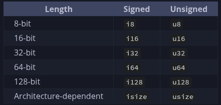

## Chapter 2
- Unless specified rust defualts to i32 type number.
- Variable shadowing occurs in rust when you declare new variable with the same name of another variable declared prior. This allows devs to change the type of the variable to reuse the variable instead of creating another variable.
- The trim() method on a String instance will remove any white spaces at the beginning and the end. If we were to convert a string to integer, this is something that must be done. Or else how would the program interpret any white space within the string..
- in ```std::io::stdin().read_line(&var)``` upon coming to this of program user would be instructed to enter a value. The value will only be passed to the progra after the user presses enter upon entering the value. That is how the method read_line() works. This pressing of enter adds a newline(\n) char at the end of the string typed. So in the case of trim() method, this also eliminates the newline characters at the end of the string.
- Thus when user enters the value 5, the read_line() store 5\n, but after using trim() method the value would be 5 no newline chars.
- the parse() method on rust converts a string to another type. Also in this case we have to explicitly tell rust what number type we wish this string to be converted to, which is u32. This is done in this part of the code ```let guess: u32```. This time guess does not have to be mutable since while the program is running we do not have to write to guess again. It has already been done.
- Also when we compare these two values, since guess is now u32, rust will assume correct should also be u32 in which case it is automatically set to u32 so that both the number can be compared against each other.
- **NOTE** The parse method can only work on characters that can logically be converted to number. Any emojis or special that cannot be translated to number would throw an error. And also parse method returns a result type. And for result type returns you would also have to include an expect(Statement) right alongside.
- The ```loop``` keyword creates an infinite loop.
- The ```break``` keyword is used to break from a loop. such as this:
```rs
    loop {
        println!("Please enter your guess: ");
        let mut guess = String::new();

        io::stdin().read_line(&mut guess).expect("Please enter a number!!");
        println!("Your Guess: {guess}");

        let guess: u32 = guess.trim().parse().expect("Please enter an integer!!");

        match guess.cmp(&correct){
            Ordering::Less => println!("Too low! Try again"),
            Ordering::Greater => println!("To big, Try again"),
            Ordering::Equal => {
                println!("Congrats you won!!");
                break;
            }
        }
```
- Often time with Result returned methods such as purse() or read-_line(), instead of using expect() to crash the program gracefully, we can instead go into using match statements to handle the errors. Such as:
```rs
let guess: u32 = guess.trim().parse(){
    Ok(num) => num,
    Err(_) => continue,
};
```
- As we know parse() returns a Result type, and Result is an enum that has variants of Ok and Err. The underscore in Err(_) is a catch-all, we are saying we will catch all type of error regardless of what it is.

## Chapter 3
- A variable is immutable when data added to that variable cannot be altered.
- By default, Rust variables are immutable. But variables can be made mutable by using the keyword ```mut``` in front of the variable name such as:
```rs
let mut result = 3;
result = 4
// ANd this shoudl be ok since result is mutable..
```
- Difference between let and const in rust is that, let creates a variable that is immutable by default. const defines a compile-time constants ( an alias for a value ) that must be explicitly typed (such that :u32 or :i64) and also cannot be changed.
- const requires type annotation where ```let``` lets the compiler infur the type of the variable automatically.
### Rust: `const` vs. `let`

| Feature | `let` (Variable) | `const` (Constant) |
| :--- | :--- | :--- |
| **Mutability** | Immutable by default; can be made mutable with `mut`. | **Always** immutable. `mut` is not allowed. |
| **Type Annotation** | Optional (usually inferred by the compiler). | **Required** (e.g., `const NAME: type = value;`). |
| **Evaluation** | **Run-time**: Calculated when the program runs. | **Compile-time**: Calculated when the code is built. |
| **Scope** | Local to the block/function where it is defined. | Can be defined in any scope, including **global**. |
| **Value Requirement** | Can hold results of any function or user input. | Must be a **constant expression** (predictable values). |
| **Memory** | Exists on the stack (or heap if specified). | Inlined directly into the binary wherever used. |

---

### 1. Defining `const`
Constants are for values that are fixed for the entire life of the program. They are useful for global configuration or magic numbers.

```rust
// Must have a type, usually written in SCREAMING_SNAKE_CASE
const MAX_POINTS: u32 = 100_000;
```
### What "Known at compile time means??"
- For a value to be used in ```const```, the compiler must be able to resolve its value before the program even runs.
- Analogy:

<ol>
<li> &nbsp;&nbsp;&nbsp;&nbsp;&nbsp;&nbsp;&nbsp;Setting the price of the menu before the restaurant even opens.</li>
<li> &nbsp;&nbsp;&nbsp;&nbsp;&nbsp;&nbsp;&nbsp;Cashing out a customer which depends on their purchase which may &nbsp;&nbsp;&nbsp;&nbsp;&nbsp;&nbsp;&nbsp;&nbsp;increase or decrease.</li>
</ol> 

- Constant values must be set when writing the program. Some return values of functions, or user input cannot be used to initialize a constant.
- Rust convention for writing the name of constant is to be all uppercase with (_) underscore between spaces.
- Constant evaluation is the process of computing the result of expression during compilation. ONly a subset of all expressions can be evaluated at compile-time.
- Const eval (Constant Evaluation) is the process where the compiler executes specific parts of your code and computes their result at compile time, rather than waiting till the program runs.
- When We declare a Const variable in Rust, we are telling the compiler this variable must be computer and evaluated before execution of the program.
- **How the compiler does it?**
- Rust has a built-in interpreter inside of its compiler called **Miri**(Mid-level Intermediate Representation Interpreter). When you compile a program, Miri literally runs your ```const``` code inside of compiler.
- Variable shadowing is the concept that, the Rust compiler will prioritize and use the second same name decalred variable, instead of using first one. One example may clarify:
```rs
fn main(){
    let x = 5;

    let x = x + 1;
    {
        let x = x * 2;
        println!("The value of x in the inner scope is {x});
    }

    println!("The value of the x is: {x}");
} 
```
- This program first creates and initialize x to 5. But then using shadowing by using the keyword ```let``` with the same variable name x, we overshadow the previous variable x and replace its value with x+1 which is 6. Now the value of x is 6 instead of 5. But within the inner scope, we shadow the new x=6 again and multiply it wiht 2 making it 12. But here is the thing, that shadowing is only available inside of that scope. As soon as we get outside of the scope, we see that x is back to 6 again. This would be the result:
```shell
$ cargo run
   Compiling variables v0.1.0 (file:///projects/variables)
    Finished `dev` profile [unoptimized + debuginfo] target(s) in 0.31s
     Running `target/debug/variables`
The value of x in the inner scope is: 12
The value of x is: 6
```
- How shadowing differs from mutability is that, if we tried to do just ```x=x+1;```, this would throw a compile time error, because x is not initialized as a mut variable. But using the keyword ```let``` lets us change the variable x to anything without initializing x as a mut variable.
- Another advantage of shadowing is that, since ```let``` is creating a new variable with the same name,, we can also change the type of that variable. Such as:
```rs
let spaces = "     "; //1
let spaces = spaces.len(); //2
```
Here the variable spaces//1 is a string type and variable spaces//2 is of type int. The keyword ```let``` lets us do that.
- But with ```mut```, changing the value of variable is possible but changing its type is not. Such as:
```rs
let mut spaces = "    ";
spaces = spaces.len();
```
And this should throw a compile-time err.
```shell
$ cargo run
   Compiling variables v0.1.0 (file:///projects/variables)
error[E0308]: mismatched types
 --> src/main.rs:3:14
  |
2 |     let mut spaces = "   ";
  |                      ----- expected due to this value
3 |     spaces = spaces.len();
  |              ^^^^^^^^^^^^ expected `&str`, found `usize`

For more information about this error, try `rustc --explain E0308`.
error: could not compile `variables` (bin "variables") due to 1 previous error
```
## Chapter 3.2: Data Types
- Two data type subset: Scalar, and Compound.
- A *scalar* type represents a single value. Rust has four primary scalar type data: Integer, float, Booleans, and characters.
- 
- Signed and unsigned integers refer whether it is possible for the number to be negative. A number that can never be negative such as values for distance can be represented using **unsigned** integer (Therefore no signs), and number that can be negative of value are represented using **Signed** integers.
- Signed numbers are stored using the two's complement representation.
- Each signed variant can store numbers from $-(2^{n-1})$ to $2^{n-1} - 1$ inclusive. Here $n$ is the number of bits that variant uses. So, an i8 can store number from $2^7$ to $2^7-1$, which equates to -128 to 127. And Unsigned variants can stored number from $0$ to $2^n$, where $n$ is the number of bits that variant uses.
- Generally we use commas to separate big numbers such as 1,000,000. But in Rust, commas cannot be used to separate number. Instead we use (_) underscores such as 1_000_000; and the compiler understands it as 1,000,000.
- **Rust default integer type is i32.**
- Rust floating types are f32 and f64.
- The default float type in Rust is f64.
- <span style="color:lightblue">**All floating points are signed**</span>
```rs
fn main(){
    let x = 4.2 //def f64
    let x: f32 = 3.0 // set to 32 bit float
    //Also reinforces that type can be changed using shadowing
}
```
- In Rust, integer division just like any other programming langauge does not generate fraction or floats. it just goes to zero or near zero.
- The **Boolean** type in Rust can be initiated either using explicit annotations or implicit annotations. Such as:
```rs
fn main(){
    let x = true; //implicit

    let x: bool = false; //explicit
}
```
- Rust Char Data Types:
```rs
fn main(){
    let a = 'a';
    let b: char = 'B";
    let smiley:char = ':)';
}
```
- Notice we declare char datas using single quotations compared to String literals where we use double quotation.
- Rust char data type is of 4 bytes, meaning it can not only represent ASCII chars but also other ACcented letters.
### Compound Types
- Compound types can group multiple values into one type. Rust has two primitive compound types: tuples and arrays.
#### Tuples
- A tuple is a general compound type that can take multiple data types values and combine them into one data type. They have fixed length and can not be changes once declared.
- Syntax:
```rs
fn main(){
    let tup: (datatypeRespectively, datatypeRespectively, datatypeRespectively) = (dataValueRespectively, dataValueRespectively, dataValueRespectively);
}
```
- **Example**
```rs
fn main(){
    let tup: (i32, f64, u32) = (-24, 3.64, 56);
}
```
- One of the ways we can extract values out of a tuple data structure is to use variables and pattern matching:
```rs
fn main(){
    let tuple: (i32, f32, u64) = (-24, 4.5, 21);
    let(x,y,z) = tup;
    // x should have the value -24
    // y should have 4.5
    // z should have 21
    println!("The value of z is: {x});
    println!("The value of y is: {y});
    println!("The value of z is: {z});
}
```
- This method of extracting data from tuple is called destructuring.
- Tuple element can also be accessed and stored in variable using dot notation along with the values index.
```rs
fn main(){
    let tuple: (i32, f64, u64) = (-24, 3.4, 21);
    let x = tuple.0;
    let y = tuple.1;
    let z = tuple.2;

    println!("The value of x is: {x}");
    println!("The value of y is: {y}");
    println!("The value of z is: {z}");

}
```
- In Rust, a tuple without any values assigned to it is called a unit. The name unit comes from Type theory and Mathematics. 
- A tuples number of possible values is the product of its elements possible values. An empty product in math equals to 1. One of the reason why tuples are called product types.
#### Array
- Another way to combine multiple values into one compound type is array.
- Unlike Tuple, all values in array has to be of same type.
- <span style="color:lightblue">**Unlike other languages where array can expand or decrease, Rust arrays are of fixed length**</span>
- Syntax:
```rs
fn main(){
    let a = [value, value, value, ....];
    //Example
    let b = [1,2,3,4];
}
```
- Values inside of an Array Data structure lives on the stack, unlike some other data structure such as vector where its content lives in the heap.
- Vectors unlike array are able to expand or shrink and its datas lives in heap.
- Explicit declaration of array requires declaring data type and its size:
```rs
fn main(){
    let array_name:[dataType; size] = [data];
    // Example
    let a: [i32, 5] = [1,2,3,4,5];
}
```
## Functions
- In Rust, just a refresher, the ```fn``` keyword is used to declare a function.
- Unlike some other languages like ```C```, rust does not care where you define your function. Whether it is before the main() or after main(), as long as it is in the same scope and the caller can call it, it will work.
```rs
fn main(){
	println!("Hello");
	another();
}  
fn another(){
	println!("Another");
}
```

	- This works and
```rs
fn another(){
	println!("Another");
}
fn main(){
	println!("Hello");
	another();
}
```
- Works as well.
- Function can also take in parameters within its braces.
- The syntax: 
```rs
fn argument(variable_name: dataType){
	//things the fn needs to execute
}
```
- In rust fn signature, The signature is the braces of functions (), you must declare the type of each parameter.
- When defining multiple parameters use commas to separate them:
```rs
fn arguments(x: i32, yo: String){
	//THings to execute
}
```
- **Rust is an expression based language**
- ***Statements*** are instructions that perform some action and do not return a value.
- ***Expression*** evaluate to a resultant value.
- Rust is called ***an expression based language*** because almost everything evaluates to a value. Unlike ```C``` and ```Java``` where there is a sharp difference between expression (Produce a value) and statements (do something, produce nothing).
- In Rust, in order to return values from a fn we do not use keywords like ```return```. Rather we use the concept of expression and use -> to denote at the fn header what type of data will be returned.
```rs
fn add(x: i32, y: i32)-> i32{
	x + y
}
fn main(){
	let x: i32 = 5;
	let y: i32 = 6;
	let sum: i32 = add(x,y);
	println!("The sum of {x} & {y} is: {sum}");
}
```
- Although the keyword ```return``` can be used to return a value from the function early if necessary.

## ```if``` Expressions
- Because ```if``` is an expression it can be used to provide value to variables being declared using ```let``` keyword.
- Remember that block of code evaluates to the last expression in them and that can also be numbers. In this case, if one block returns a number expression and the rest of the if block or associated block also must return number type. We will get an error if types are mismatched in ```if``` arms:
```rs
fn main(){
	let condition = true;
	let y = if condition { 5 } else {"Wool"};
	println!("The value of y is: {y}");
}
//this would throw an error because 5 is i32 and "wool" is char.
//Not same data type in both if hands
```
- In Rust, the loop{} acts like while loop in other programs but has no boolean checking like while loop. Rather programmers uses keyword like ```break``` to break out of such loop.
- loops can be labeled as such:
```rs
fn main(){
    let mut count = 0;
    'counting_up: loop {
        println!("Count = {count}");
        let mut remaining = 10;

        loop {
            println!("Remaining: {remaining}");
            if remaining == 9 {
                break;
            }
            if count == 2 {
                break 'counting_up;
            }
            remaining -= 1;
        }
        count += 1;
    }
    println!("End count = {count}");
}
```
- Typically ```break``` and ```continue``` works within the block of loop applied on. But if you want to specify a particular loop to be broken or continued within the entire block that when loop label comes in. 
- **Loop Label must begin with single quote, but dont end with a single quote or any quote marks for that matter**
- ```While``` loop:
```rs
while Condition {
    //Do Task
}
//Example
fn main(){
    let mut number: u32 = 3;

    while number != 0 {
        println!("Yello!!");
        number -= 1;
    }
}
```
- ```while``` loop can be used to loop over compound data types such as array or tuples.
```rs
fn main(){
    let array: [i32; 5] = [1,2,3,4,5];

    let mut index = 0;

    while index < 5 {
        println!("Values: {}", a[index]);

        index += 1;
    }
}
```
- A better approach is ```for``` for traversing through arrays or tuples. Imagine you updated the array to habe 4 elements now, but forgot to update the ```while``` loop. Now the program will panick because it is still looking for the object at 4<sup>th</sup> element.
- For loop for the same code snippet:
```rs
fn main(){
    let a: [i32; 5] = [1,2,3,4,65];

    for elements in a{
        println!("Values: {elements}");
    }
}
```
- Also Rust default range can be used for for loop. You may remember how we set the range up for random numbers in guessing game using this notation ```(startingNum....EndingNum)```. In Rust for loop the same can be done to run the loop a certain time or from certain range as in:
```rs
fn main(){
    for num in (1..4){
        println!("{num}");
    }
}
```
- This code snippet will count up to 4 but not including 4. **REMEMBER THAT**
- The countdown can also be done in reverse using the ```rev()``` fn. such as:
```rs
fn main(){
    for num in (1..4).rev(){
        println!("{num}");
    }
}
```
- Practice generating fibonacci number!!
```rs
use std::io;

fn main(){

}

fn fibonnaci(n: i32) -> i32 {
    let mut prev: i32 = 0;
    let mut current: i32 = 1;

    if n==0{
        prev
    } else if n == 1{
        current
    } else {
        for fib in 2..=n{
            let next = prev = current;
            prev = current;
            current = next;
        }
        current
    }

}
```
# Ownership
- Ownership is the feature that makes Rust such memory safe language. This enables Rust to make memory safety guarantees without needing a garbage collector.
- **Ownership** is a set of protocols that govern how a Rust program manages memory. All programs have to manage the way they use a computer's memory while running.
- In the Stack, only data that are fixed in size should be stored. Dynamic data or data that may change in size should be stored in heap.
- When you put data on the heap, you request a certain amount of space. The memory allocator looks for and finds an empty spot big enough to store the data you are intending on storing and marks that space as allocated/in use, after which it return a pointer(Pointer is value that points to that memory space).
- **Allocating space in heap is known as allocating, but pushing data onto stack is not called allocating necessarily**
- The pointer that is returned from the process of allocation is stored in stack. Why? Why the pointer of heap is stored in stack?? Because the simple reason is that pointer do not change in size. The size of allocated heap may change from 20Kb to 100Kb, but the address does not necessarily change.
- ***Analogy***: Imagine you set up a banquet hall(BH02) for 50 people initially. But later on, the number of people increased to 80 people. So you just add more tables and chairs for the increased number of people. You do not necessarily change the entire banquet hall(BH02) and have people seat in different room. You just increased the capacity of BH02 but did not change the hall itself thus the address of remaining the same..
- Typically pushing onto a stack is much faster than allocating on heap. The sheer reason is the allocator has to find the proper space for the data that is being allocated. Whereas on the stack this function of looking for space do not exist. A processor can work more efficiently if the data that needs to be processed is right next to the current data process. 
- **NOTE**: The main purpose of **Ownership** is to manage heap data.
- Ownership rules(Something to remember or perhaps practice on)
    1. Each value in Rust has an owner.
    2. There can only be one owner at a time.
    3. WHen the owner goes out of scope, the value will be dropped.
- A scope is the range within a program for which an item is valid.
```rs
fn main(){
    // s is not valid here
    let s = "Hello";
    // The scope of var "s" start at
    // First { and ends }. This var
    // can not be accessed outside of
    // this scope.
}
```
- Such that this code snipper will not compile:
```rs
fn main() {
    println!("Out of Scope {s}");
    let s = "Hello";
    println!("In scope {s}");
}
```
```sh
HOST@HOST-edu in repo: ownership/src on  main +/- [?] via 󱘗 v1.94.0 
 󰛓 ❯ cargo run
   Compiling ownership v0.1.0 (/home/playaow/Documents/Rust/ownership)
error[E0425]: cannot find value `s` in this scope
 --> src/main.rs:3:28
  |
3 |     println!("Out of scope{s}");
  |                            ^ not found in this scope

For more information about this error, try `rustc --explain E0425`.
error: could not compile `ownership` (bin "ownership") due to 1 previous error
```
## The ```String``` Type
- String literal can be initiated using the from() function.
```rs
fn main(){
    let s = String::from("Hello");
}
```
- String initiated using from() can be mutated and additional data can be added to these.
```rs
fn main(){
    let mut s = String::from("Hello");

    s.push_str(", world"); //push_str appends a literal to a string
    println!("{s}");
}
```
- String literals such as ```let s = "Hello"``` is hardcoded in the program at compile time. You cannot change the size of this variable at runtime because it is stored at stack.
- While as we can see, a ```String``` data type that lives on heap can be expanded and you can ask for more room to the OS depending on your need, it the room gets allocated at runtime.
- 


